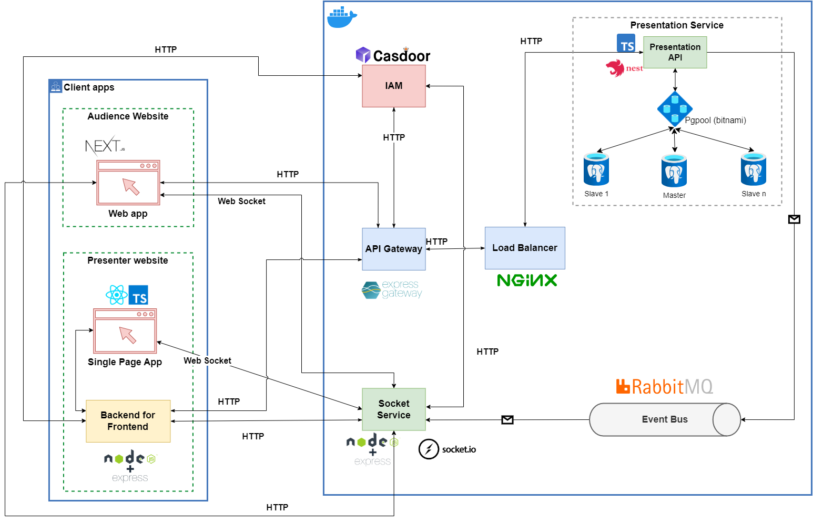
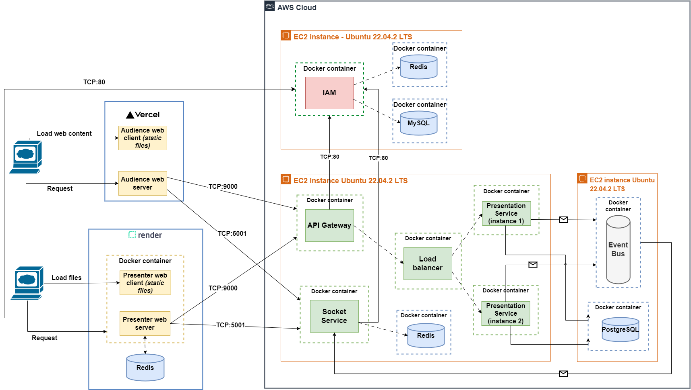

# Presento System Overview

## About this system

This platform enables users to design and publish presentations in order to gather anonymous feedback in real time. It comprises two web applications for clients (MVP) and a microservice system underneath.

## Live Demo

1. Presento website (for presentation owners)

    <https://presentoapp.onrender.com/>

2. Presenti website (for users)

    <https://presenti.vercel.app/>

## Services

1. API Gateway

    <https://presento-gateway.onrender.com/>

2. Socket service

    <https://presento-socket.onrender.com/>

3. Presentation service

    <https://presentation-service.onrender.com/>

## Architecture

### Logical view

### Deployment view

## Repositories

- [API Gateway](https://github.com/Name-Later-Team/api-gateway)
- [Presentation Service](https://github.com/Name-Later-Team/presentation-service)
- [Socket Service](https://github.com/Name-Later-Team/socket-service)
- [Presento](https://github.com/Name-Later-Team/presento)
- [Presenti](https://github.com/Name-Later-Team/presenti)
- [Docker Registry](https://github.com/Name-Later-Team/docker-registry)
  - Docker compose and general configuration for services, databases.
  - Note: Identity Access Management (Casdoor), RabbitMQ, Nginx are stored inside.
